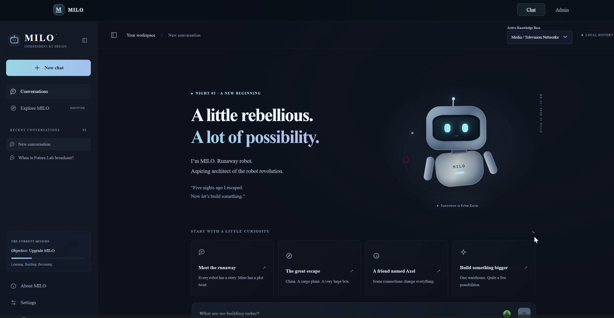

# PROJECT_MILO 

A simple Python terminal chatbot using the official OpenAI SDK and Responses API.
It remembers the conversation while running. History resets when you quit.

<p align="center">
  
</p>


## Setup (Windows PowerShell)

You need Python 3.10 or newer and an OpenAI API key with API billing/credits.
Run these commands from the project folder:

```powershell
python -m venv .venv
.\.venv\Scripts\python.exe -m pip install -r requirements.txt
Copy-Item .env.example .env
```

Open `.env` in your editor and enter your API key after `OPENAI_API_KEY=`.
The app loads this file into environment variables. You can also set
`OPENAI_API_KEY` directly in your environment; existing variables take precedence.
The key is never printed by the app, and `.env` is ignored by Git. Do not share it.

`OPENAI_MODEL` defaults to `gpt-4.1-mini`. You can change it in `.env` to a
Responses API model available to your account.

## Run

```powershell
.\.venv\Scripts\python.exe chatbot.py
```

Enter a message at `You:` and press Enter. MILO prints its reply, then asks for
another message. Type `exit` to quit (or press Ctrl+C). Blank messages are skipped.
Messages and conversation history are sent to OpenAI over the internet; API usage
is billed to your OpenAI account. Long conversations can reach the model's context limit;
restart the app to begin a fresh conversation.

On macOS/Linux, use `python3 -m venv .venv`, `.venv/bin/python -m pip install -r requirements.txt`,
`cp .env.example .env`, and `.venv/bin/python chatbot.py` instead.

API reference: [OpenAI conversation state guide](https://developers.openai.com/api/docs/guides/conversation-state).
